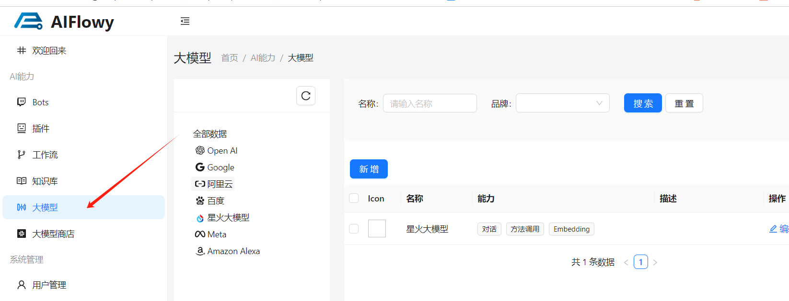
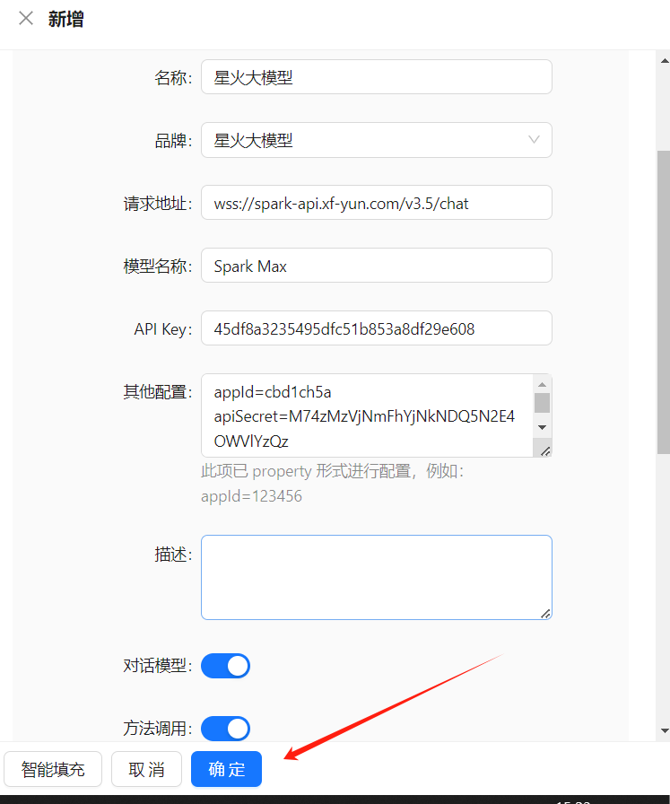
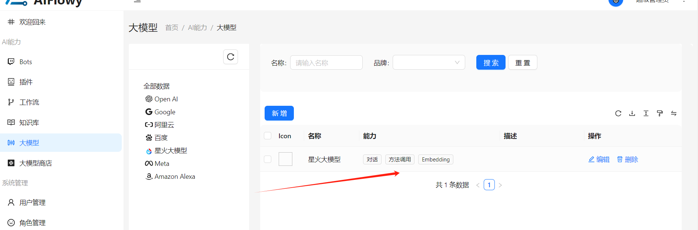
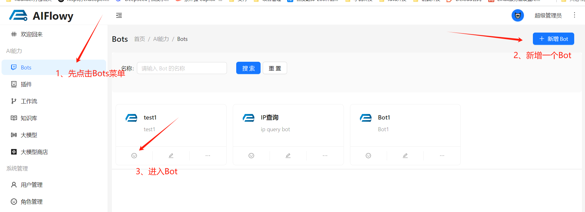
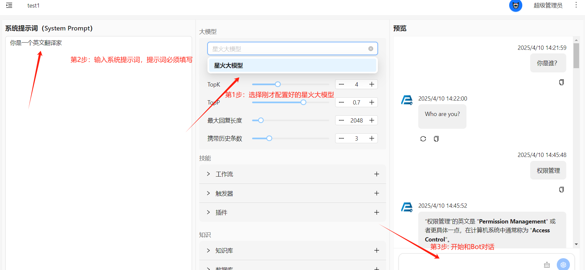

# Bot 是什么

## 前言

在大模型（如GPT、Claude、Llama等）的语境中，Bot（机器人）是指基于大型语言模型（LLM）构建的自动化对话代理，能够通过自然语言与用户交互，模拟人类对话行为。以下是清晰的技术和功能解析

## Bot的本质

是大型语言模型的应用层封装，将模型的文本生成能力转化为可交互的服务。
典型例子：ChatGPT的对话界面、微信中的AI客服、游戏NPC的智能对话。

## 与大模型的关系

**大模型** = 大脑：提供语言理解、知识存储、逻辑推理等底层能力。

**Bot** = 交互终端：负责接收用户输入、调用模型计算、返回响应并管理对话流程。
## 基于大模型

智能对话 ： **Bot** 通过接入如 **AIFlowy** 中的 **Llm.java** 及其实现类（例如： **OpenAiLlm** 、**QwenLlm** 等），能够理解并生成自然语言文本，实现与用户的高质量对话。
知识运用 ：大模型赋予了 **Bot** 广泛的“知识”和“理解”能力，使其不仅能回答问题，还能进行逻辑推理、情感分析、甚至创造性的写作。

# 快速上手
## 1. 准备工作

点击左侧菜单栏的 **大模型**

**点击新增，配置大模型的相关参数，并保存。**

**注意：**

星火大模型内容请到网址https://console.xfyun.cn/services/bm35 获取，需要其账户余额充足。

智普 AI 的 Api Key 请去https://open.bigmodel.cn/usercenter/apikeys 获取，同时保证其账户还有可用余额。

**然后就能看到刚才配置的大模型**

## 2. Bot实战
**点击左侧菜单栏的 **Bots**, 新增一个Bot，并配置Bot名称和描述**

**Bot对话**

