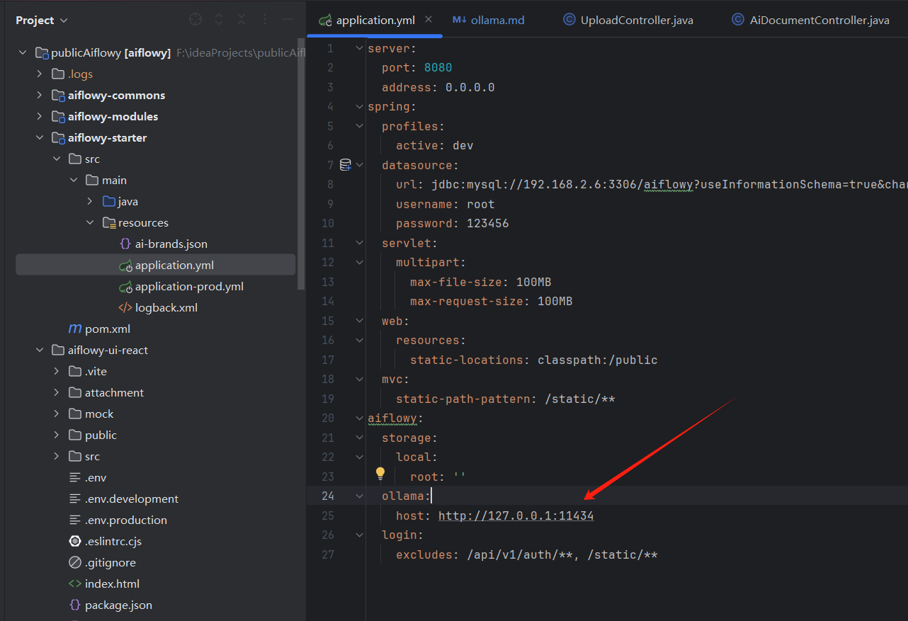
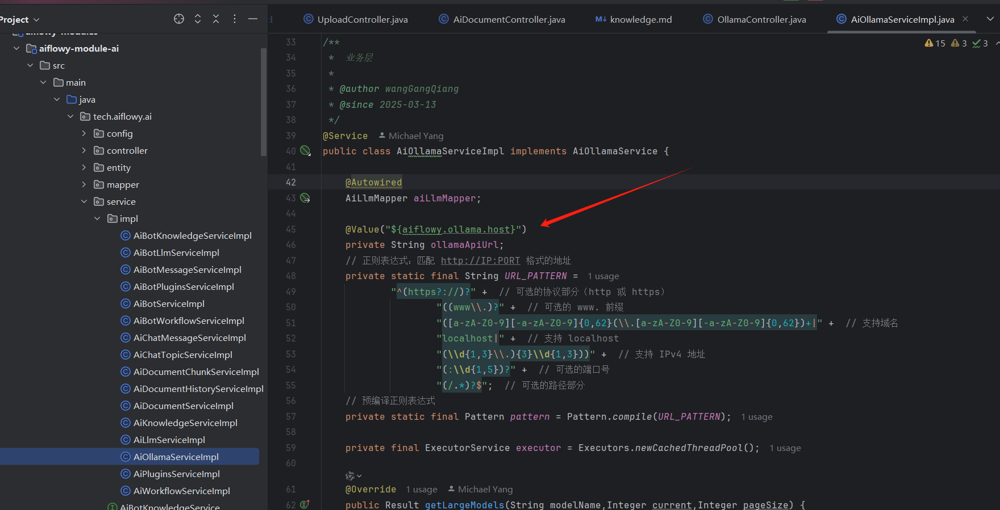
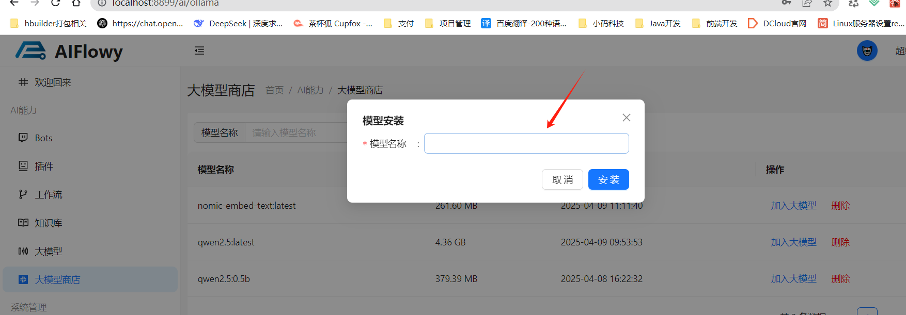

# ollama

## 一、什么是ollama

Ollama（通常写作 Ollama）是一个开源项目，专注于在本地计算机上运行、部署和管理大型语言模型（LLMs）。它旨在简化本地大模型的下载、配置和交互过程，特别适合开发者、研究人员和AI爱好者进行本地实验和开发。

## 二、下载安装及基本使用示例

1、安装 Ollama
官网（https://ollama.com）提供一键安装包，支持多平台。

2、下载模型

```cmd
ollama pull qwen2.5:1.5b  # 下载 Meta 的 LLaMA 2 模型
```

3、运行模型

```cmd
ollama run qwen2.5:1.5b  # 启动交互式对话
```

4、适用场景

本地开发与测试：快速验证模型效果，无需申请API或支付云服务费用。

隐私敏感场景：数据完全本地处理，避免上传到第三方。

教育/研究：学习大模型的工作原理，进行二次开发。

## 三、AIFlowy 中 ollama 的使用

1、配置 ollama, 参考如下图, aiflowy.ollama.host 配置您的 ollama 的地址

```yml
aiflowy:
  ollama:
    host: http://127.0.0.1:11434
```



2、在 **AiOllamaServiceImpl** 类中注入 ollama 的地址



3、打开大模型商店，这里下载的模型都是基于您在 application.yml 文件中配置的 ollama 地址下载模型的

