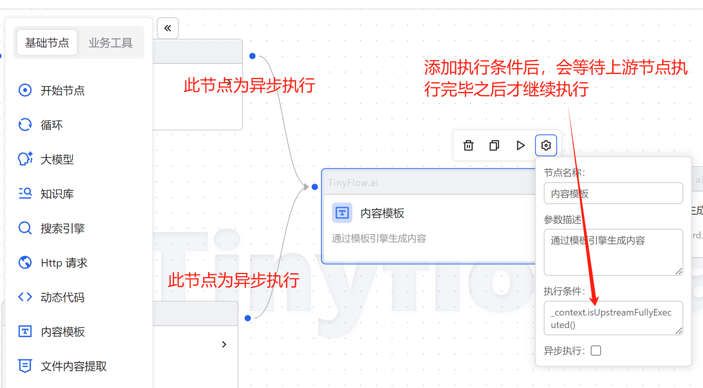

# 节点上下文

可以通过 `_context` 获取节点上下文的相关信息。

## isUpstreamFullyExecuted 方法

在一些场景中，需要判断上游节点是否已经执行完毕，可以通过 `_context.isUpstreamFullyExecuted()` 方法来判断。

比如上游有多个节点是异步执行的，那就需要在当前节点判断上游节点是否执行完毕，等待上游全部执行完毕才能继续执行当前节点。

如图：

