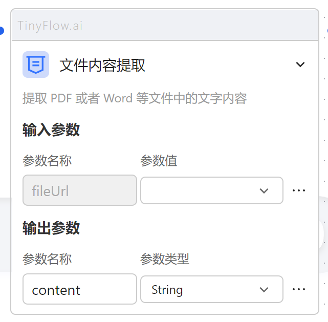

# 文件内容提取



输入参数：
- `fileUrl` 文件可访问的地址
输出参数：
- `content` 文件内容

## 后端实现

在 `aiflowy-module-ai` 模块下的 `node` 包中。

接口 `ReadDocService` 目前有两个实现类。

- `DefaultReadService`
> 默认实现，可实现简单读取文档内容。

- `GiteeParseService`

> 调用模力方舟的接口实现，需在配置文件中配置模力方舟的 appKey 并指定 `node.reader` 为 `giteeReader`。

```yaml
node:
  reader: 'giteeReader'
  gitee:
    appKey: 'your appKey'
```

> 如果无法满足需求，可自行实现接口 `ReadDocService` 并指定 `node.reader` 为你自己实现的 `bean` 即可。