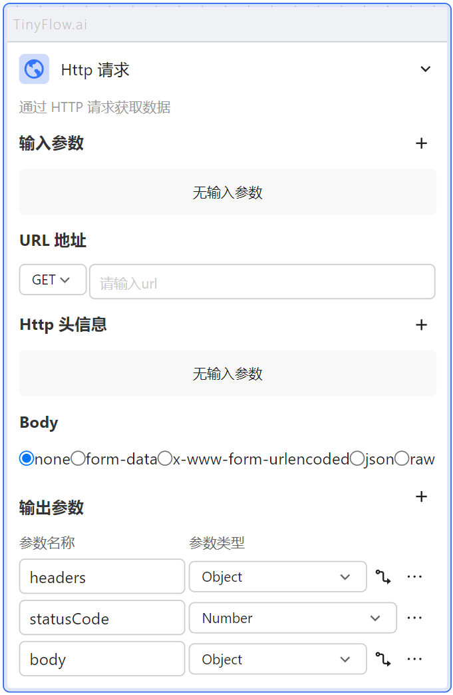
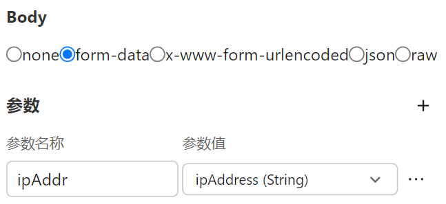
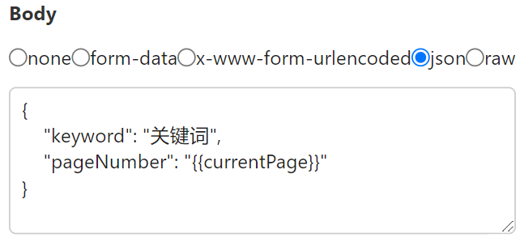
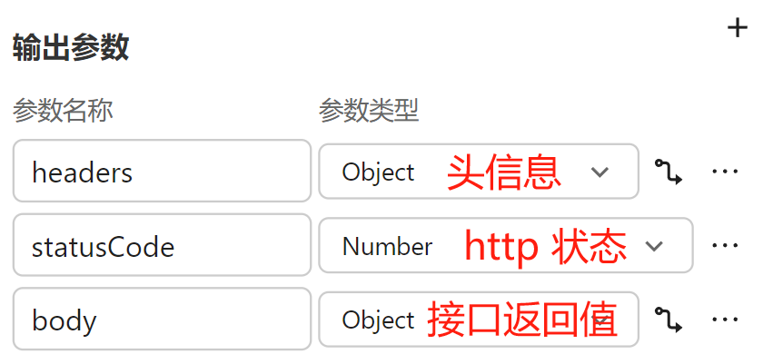

# Http 请求



## URL 地址

选择接口的请求方式并填写请求地址。

## Http 头信息

填写该接口所需的请求头信息。

## Body 请求体

### none

无请求体

### form-data

请求体为表单格式：`a=1&b=2&c=3`

值可以为固定值或者引用值。



### x-www-form-urlencoded

请求体为表单格式：`a=1&b=2&c=3`

值可以为固定值或者引用值。

与 `form-data` 的区别是 `x-www-form-urlencoded` 仅支持文本类型数据。

### json

以JSON格式发送请求体，值可以为固定值或者引用值。

请求体示例：

```json
{
  "keyword": "关键词",
  "pageNumber": "{{currentPage}}"
}
```


> currentPage 为引用变量。

### raw

Raw 指的是未经处理的原始数据格式。它是一种非常灵活的数据传输方式，允许发送者向服务器发送任何类型的数据，而不限于特定结构或格式。例如：

- 文本文件：可以是纯文本（text/plain）
- HTML文档：用于网页（text/html）
- XML 数据：一种常见的数据交换格式（application/xml）
- JSON 数据：轻量级的数据交换格式（application/json）

当使用 raw 发送数据时，必须通过设置 Content-Type 头来明确告知服务器即将接收的数据类型。这种灵活性使得 raw 成为一个非常强大的工具，适用于各种复杂的数据传输需求。

## 输出参数

在 Http 节点中，输出参数在接口返回值的基础上固定封装了一层：

- headers: 返回的响应头信息
- statusCode: 响应状态码
- body: 接口实际返回的数据

